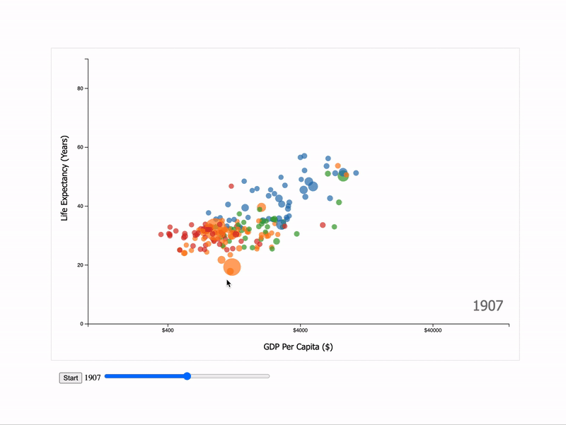

# D3.js Bar Chart Example

### This chart depict GDP, life expectancy and population of different countries all arount the world over the more than past 200 years.

Inspired by a very similar chart used in [The Joy of Stats - BBC Four](https://www.youtube.com/watch?v=jbkSRLYSojo)

